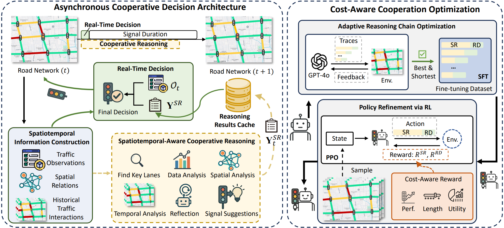

# CoLLMLight: Cooperative Large Language Model Agents for Network-Wide Traffic Signal Control

Official implementation for **CoLLMLight**, accepted by ICLR 2026.

## Table of Contents

- [Overview](#overview)
- [Requirements](#requirements)
- [Data](#data)
- [Quick Start](#quick-start)
- [Training Workflow](#training-workflow)
- [API Configuration](#api-configuration)
- [Citation](#citation)

<a id="overview"></a>
## 1. Overview

This repository provides the official implementation for CoLLMLight: Cooperative Large Language Model Agents for Network-Wide Traffic Signal Control.

Network-wide optimization in traffic signal control (TSC) requires agents to cooperate across intersections. However, recent Large Language Model (LLM)-based TSC agents are designed as independent agents without inter-intersection cooperation, which limits their effectiveness at the network level. To address this gap, we propose CoLLMLight, a cooperative LLM agent framework for network-wide traffic signal control. CoLLMLight introduces a spatiotemporal-aware cooperative reasoning module to analyze interactions with neighboring agents and produce cooperative suggestions. This reasoning process is implemented within an asynchronous decision architecture to support multi-step reasoning without compromising real-time responsiveness. To further improve both cooperation effectiveness and reasoning efficiency, we propose a cost-aware cooperation optimization strategy. It first applies adaptive reasoning optimization to equip the LLM with the capability to generate concise yet effective cooperative reasoning across varied traffic conditions. Then, it refines the policy using reward signals that encourage both effective decision-making and efficient reasoning. Extensive experiments on four real-world traffic networks demonstrate that CoLLMLight significantly outperforms existing methods by enabling more effective and generalizable cooperation, while ensuring low decision latency and efficient token usage.



<a id="requirements"></a>
## 2. Requirements

- `python>=3.9`
- `cityflow` (Requires a Linux environment; tested on Ubuntu)
- `tensorflow-cpu==2.8.0` or `tensorflow-gpu==2.8.0`
- `torch==2.2.2`
- `transformers==4.48.2`
- `trl==0.9.2`
- `vllm`
- `lmdeploy`

You can install the required Python packages using:

```bash
pip install -r requirements.txt
```

<a id="data"></a>
## 3. Data

The repository follows the CityFlow data layout. Each traffic network contains a roadnet file and one or more traffic flow files:

```text
data/
├── Hangzhou/4_4/
├── Jinan/3_4/
├── NewYork/28_7/
├── Synthetic/4_4/
└── FinetuneData/
```

For example, the New York benchmark uses:

- Roadnet: `data/NewYork/28_7/roadnet_28_7.json`
- Traffic flow: `data/NewYork/28_7/anon_28_7_newyork_real_double.json`

<a id="quick-start"></a>
## 4. Quick Start

To run inference with a trained model, follow these steps.

**Step 1: Deploy the LLM Inference Server**

Deploy your chosen LLM with an OpenAI-compatible local inference service such as `lmdeploy` or `vllm`. The `model_path` should be a local path or Hugging Face-compatible model identifier.

```bash
# Example using lmdeploy
lmdeploy serve api_server /path/to/your/llm --tp <num_gpus>
```

**Step 2: Run the Simulation**

Execute the main script to run the agent in the CityFlow simulation environment.

```bash
python run_CoLLMlight.py \
    --model_path /path/to/your/llm \
    --dataset 'newyork_28x7' \
    --traffic_file 'anon_28_7_newyork_real_double.json'
```

<a id="training-workflow"></a>
## 5. Training Workflow

The training process consists of three main stages.

### Stage 1: Simulation Data Sampling

First, sample simulation data from the CityFlow environment. This data will serve as the basis for the subsequent training steps.

```bash
python run_fts.py
```

The sampled data will be saved to `./data/FinetuneData/SynTrain_sample.json`.

### Stage 2: Adaptive Reasoning Chain Generation

Next, generate synthetic reasoning chains using a powerful teacher model (e.g., GPT-4o) and the data sampled in the previous step.

**1. Configure API access:**
Set your API credentials through environment variables. The code reads `OPENAI_API_KEY` by default and supports OpenAI-compatible endpoints through `OPENAI_BASE_URL` or `OPENAI_API_URL`.

```bash
export OPENAI_API_KEY="your_api_key"

# Optional: use a custom OpenAI-compatible endpoint.
export OPENAI_BASE_URL="https://api.openai.com/v1"
```

**2. Generate Data:**
Run the generation script.

```bash
python reasoning_tuning_data_synth.py
```

The output, saved in `./data/FinetuneData/syn_rt_data.json`, contains the reasoning data for fine-tuning a base LLM. You can use standard fine-tuning libraries like a LLaMA Factory for this purpose.

### Stage 3: Policy Refinement

Finally, use the fine-tuned LLM from Stage 2 to perform policy refinement via Proximal Policy Optimization (PPO).

**1. Configure Model Path:**
In `config/ppo_config.yaml`, set the `model_name` parameter to the path of your fine-tuned LLM from Stage 2.

**2. Run PPO Training:**
Execute the PPO training script.

```bash
python ppo_ft.py
```

<a id="api-configuration"></a>
## 6. API Configuration

`utils/LLMs.py` uses the following environment variables for teacher-model calls:

- `OPENAI_API_KEY`: API key for the chat completion service.
- `OPENAI_BASE_URL`: Base URL for an OpenAI-compatible API. Defaults to `https://api.openai.com/v1`.
- `OPENAI_API_URL`: Full chat completions URL. If set, this takes priority over `OPENAI_BASE_URL`.

Examples:

```bash
# Official OpenAI endpoint
export OPENAI_API_KEY="your_api_key"

# Custom OpenAI-compatible endpoint
export OPENAI_API_KEY="your_api_key"
export OPENAI_BASE_URL="https://your-endpoint.example.com/v1"
```

<a id="citation"></a>
## 7. Citation

If you find this repository useful, please consider citing our paper:

```bibtex
@inproceedings{yuan2026collmlight,
  title={Co{LLML}ight: Cooperative Large Language Model Agents for Network-Wide Traffic Signal Control},
  author={Yuan, Zirui and Lai, Siqi and Liu, Hao},
  booktitle={The Fourteenth International Conference on Learning Representations},
  year={2026},
  url={https://openreview.net/forum?id=KeJqoEVOeY}
}
```
